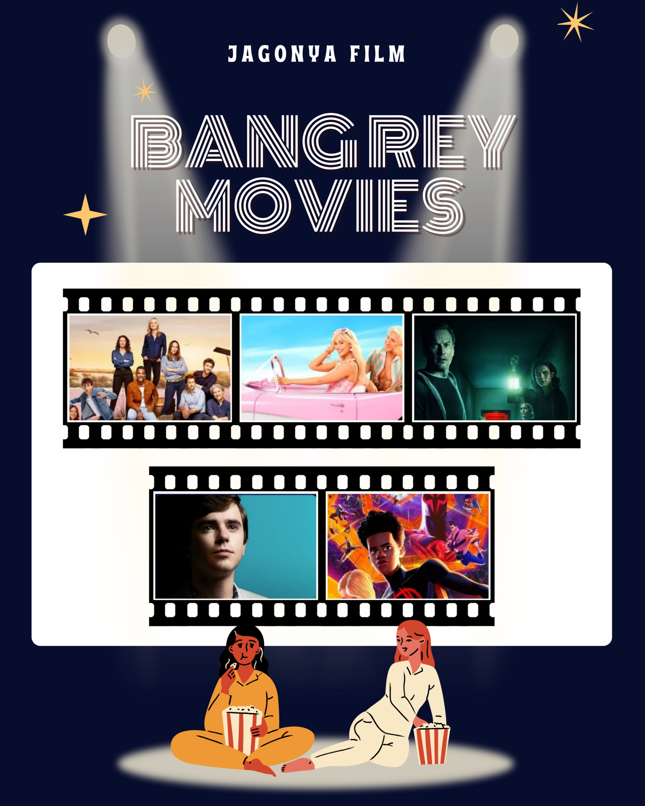
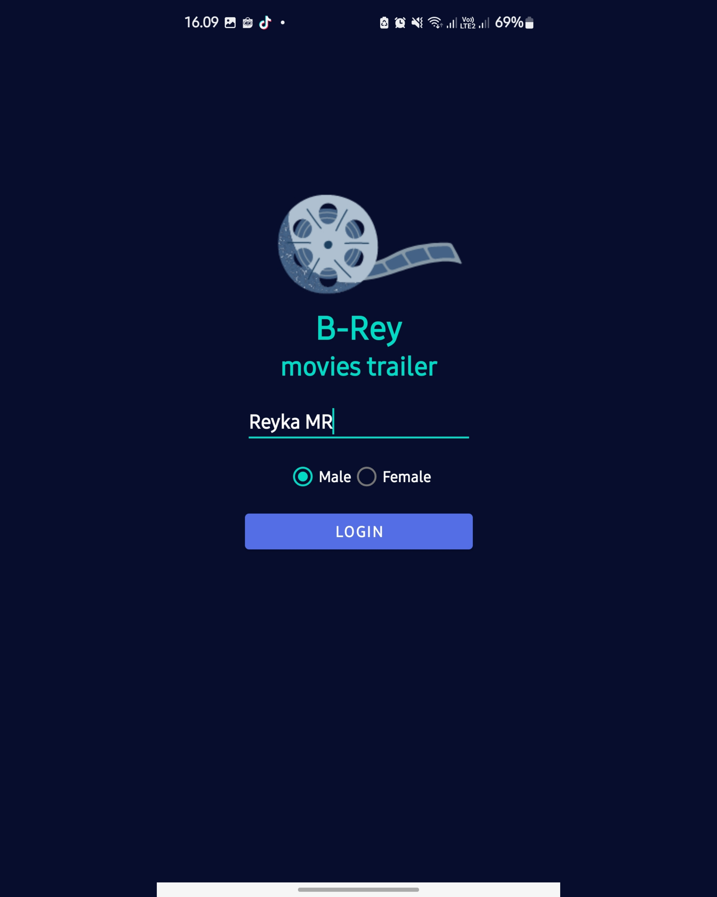
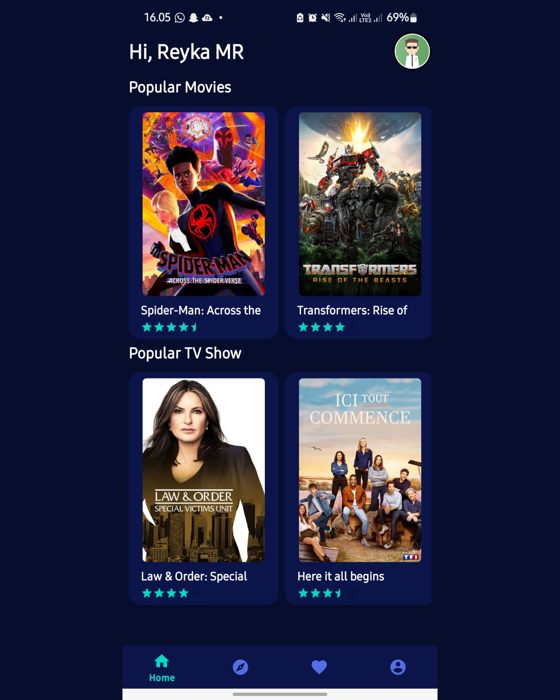
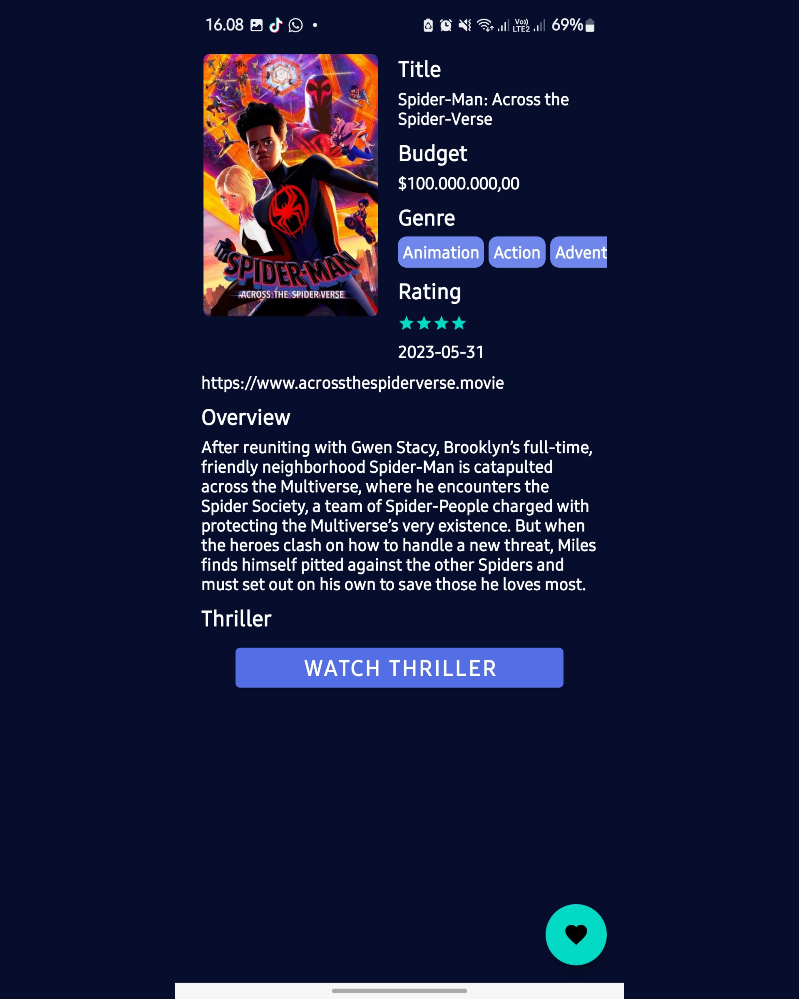
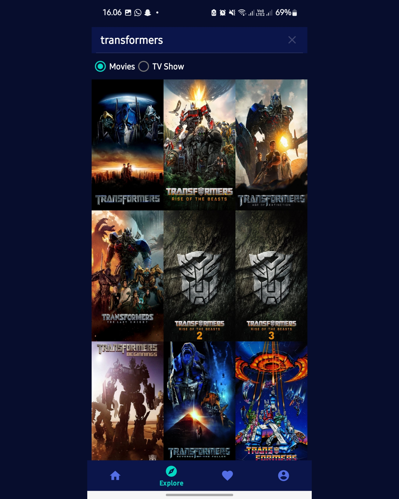
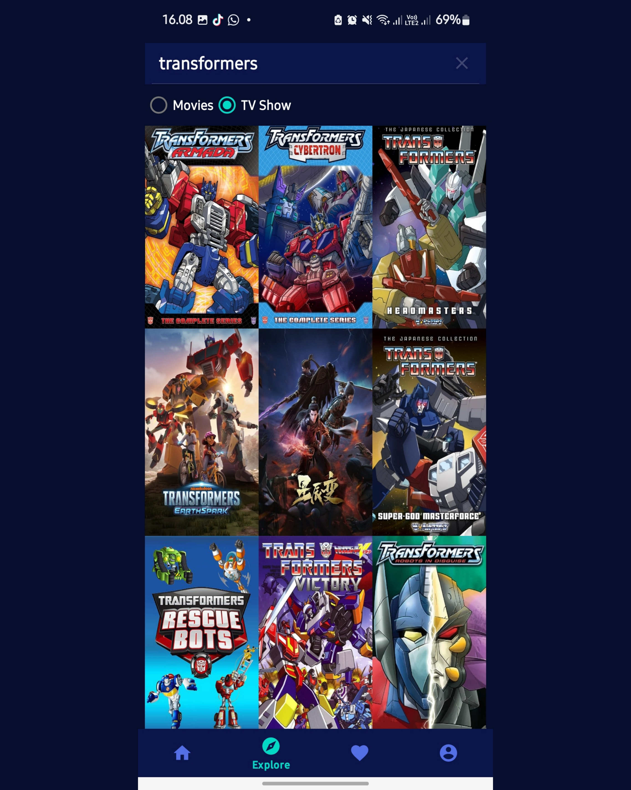
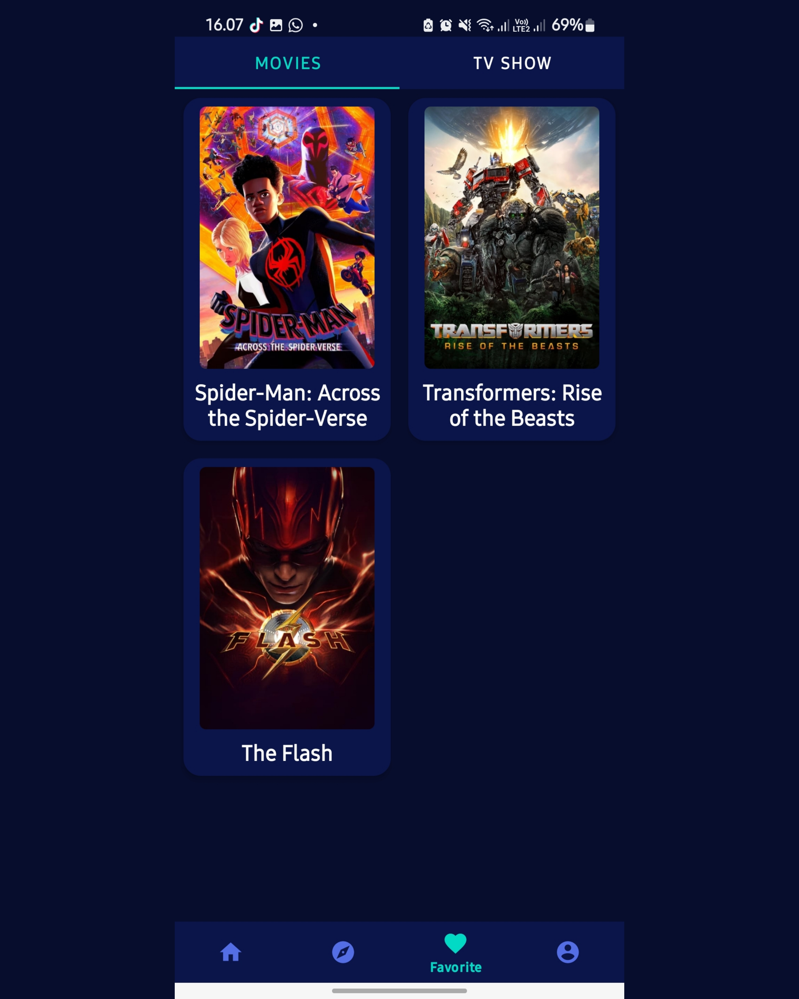
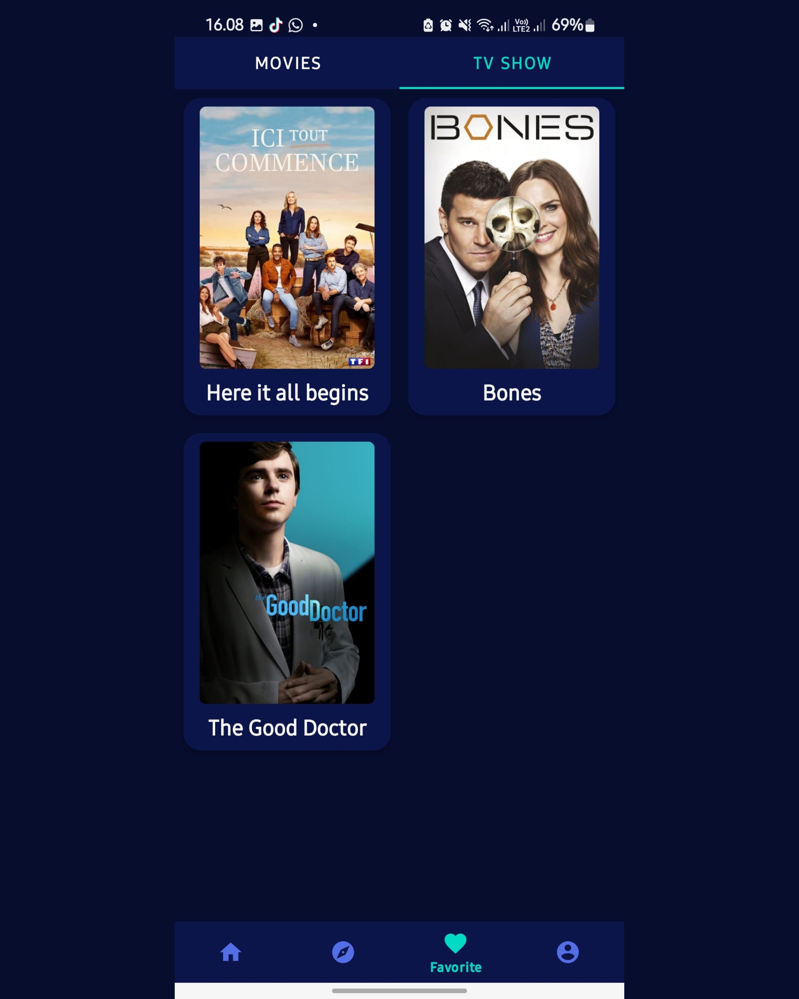
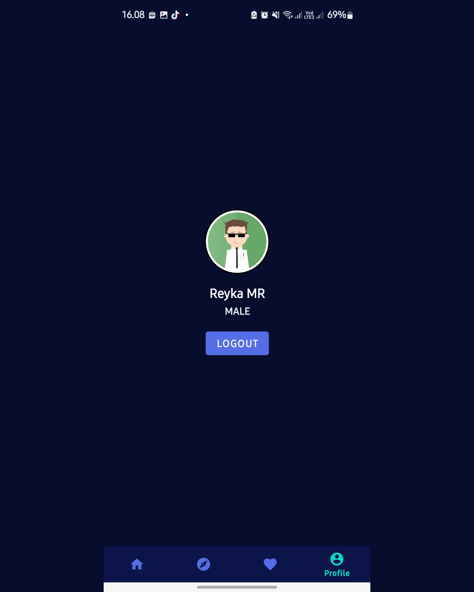

# 🎬 Aplikasi Android Pencarian Film


Aplikasi Android untuk pencarian film menggunakan **API OMDb**, dibuat dengan **Android Studio** dan bahasa pemrograman **Kotlin**. Aplikasi ini memiliki fitur lengkap mulai dari splash screen, login, pencarian film/TV show, hingga menyimpan film favorit.

---

## 📸 Tampilan Aplikasi
<table>
  <tr>
    <td></td>
    <td></td>
    <td></td>
  </tr>
  <tr>
    <td></td>
    <td></td>
    <td></td>
  </tr>
  <tr>
    <td></td>
    <td></td>
    <td></td>
  </tr>
</table>

---

## ✨ Fitur Utama
- **Splash Screen** → Tampilan awal aplikasi sebelum masuk ke menu utama.  
- **Login** → Autentikasi sederhana agar pengguna bisa mengakses fitur aplikasi.  
- **Home (Popular Movies)** → Menampilkan daftar film populer.  
- **Detail Film** → Menampilkan informasi lengkap tentang film/TV show yang dipilih.  
- **Like Film Favourite** → Simpan film atau TV show ke daftar favorit.  
- **Pencarian Film & TV Show** → Cari berdasarkan judul dengan dukungan filter Movies atau TV Show.  
- **Favourite** → Halaman khusus untuk melihat daftar film/TV show yang telah disukai.  
- **Profile** → Menampilkan profil pengguna.

---

## 🛠 Teknologi yang Digunakan
- **Kotlin** (Bahasa Pemrograman)
- **Android Studio** (IDE)
- **OMDb API** (Sumber Data Film & TV Show)
- **MVVM Architecture** (opsional, jika dipakai)
- **Room Database** (untuk menyimpan data favorit secara lokal)
- **Retrofit** (untuk konsumsi API)
- **Glide/Picasso** (untuk load gambar poster film)

---

## 🚀 Instalasi
1. Clone repositori:
   ```bash
   git clone https://github.com/reykamr/bangrey-movies-trailer.git
2. Buka di Android Studio
3. Pastikan sudah memiliki API Key dari OMDb API.
4. Masukkan API Key ke dalam file gradle.properties atau langsung di Retrofit config:
   const val API_KEY = "YOUR_API_KEY"
5. Jalankan aplikasi di emulator atau perangkat Android.

---

## 📌 Catatan
- Aplikasi ini membutuhkan koneksi internet untuk melakukan pencarian film & TV show.
- Data favorit tersimpan secara lokal di perangkat menggunakan Room Database.
